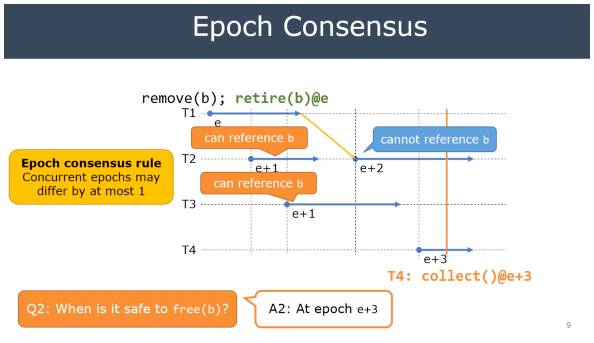

Q. What is memory reclaimation?

Memory reclaimation is about when the memory can be freed safely.

Q. Why memory reclaimation is hard?

We don't know when the processes are finishing the access of the object so that
we can free it safely.

Key Idea of Epoch-based Reclaimation:

* Different EBR implementation may have different epoch consensus rule
* If a thread does exit its active state, reclaimation is indefinitely blocked
    * becaues the epoch can't be advanced

Q. Why can't we safely free(b) at e+2?

Because e+2 can overlap with e+1 and e+1 can have the reference of b.
When a thread is at e+3, no other concurrent threads are overlap with e+1 and e.

Crossbeam Epoch:

* Design Consideration: makes the use of API does not easy to break the rule of EBR
* guard: RAII wrapper of the active states 
    * the active state is finished when the guard is dropped
* guard.delay_destory is the collect/retire function => the collection function must called within active state
* shared memory access operations (Atomic<T>) require the guard reference => they must called within active state

