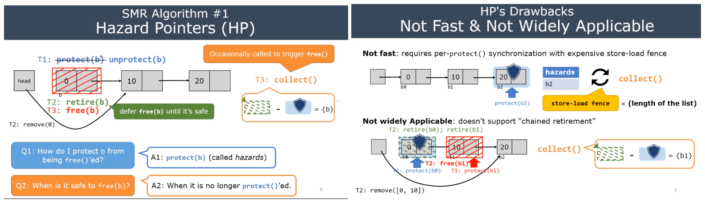

* APIs:: 
    * protect(b) - call protect(b) before accessing b
    * unprotect(b)
    * retire(b) - defer free(b) until it is safe
    * collect() will be triggered occasionally to call free() to the safe objects
        * called by any thread

Q. How to protect b from being free?

* protect(b)

Q. When is it safe to free b?

* when b is no longer protected

Cons:

* protect() requires synchronization with store-load fence
    * traversal a linked list requires calling protect() per node
* does not support chain retirement

