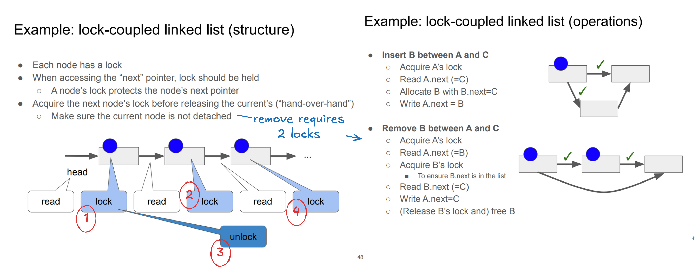

# Concurrent Data Structure

## Scalability

* shrink lock scope -> less contention
* avoid writes -> less cache invalidation
    * called optimistic concurrency control

# Lock-Coupled Linked List

Cons: 

* deadlock is possible for doubly linked list
* cache invalidation (due to lock acquisition) even for read operation

