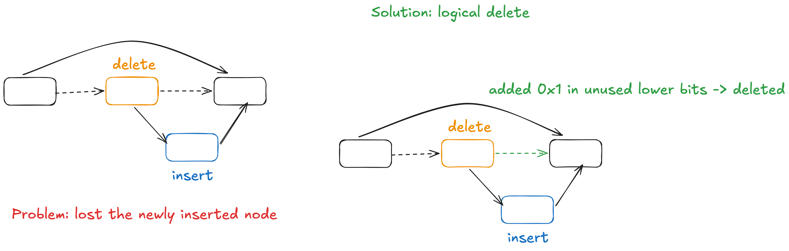

lock freedom: at least one of the thread make progress

* challenges: thread pause (due to I/O, crash), deadlock, livelock
* key idea of the solution: single-instruction commit point
    * no lock -> no deadlock, livelock
    * single-instruction -> no pause in the middle of the execution, either abort or commit
    * the commit point is the single contention point -> scalability

Treiber's Stack: push/pop synchronize with CAS on the top location

* data structure: a linked list
    * top -> 42 -> 37 -> 666 -> null
* pop: 
    * Read top -> 42
    * Read 42 -> 37
    * CAS top to 37
* push(100):
    * 100 -> 42
    * CAS top to 100

Michael-Scott's Queue:

* push: CAS the tail.next from null to new node and CAS the tail from tail to new node
* pop: CAS the head to head.next
    * head.next becomes the new dummy sentinel node => the queue is empty when head.next points null
* challenge:
    * the tail can be state
        * solution: allow every thread to CAS the tail (CAS fails implies the tail is advanced)

Lock-free Sorted Singly Linked List:

* 2 phases: traversing -> operation (insert/delete/lookup)
* challenges:
    * insert and delete can run in parrallel
        * solution: logical deletion (add a tag to the delete node's next pointer in the unused lower bit to indicate this node is deleted)
            * insertion and logical deletion are changing the same memory location (delete node's next pointer) -> can be sychronized
    * travering: how to deal with logical deletion

