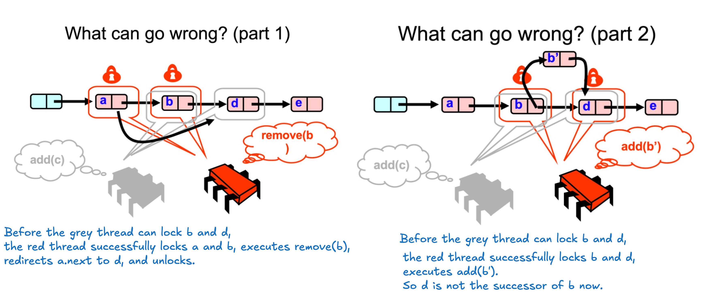

Optimistic Locking:

* Idea: Find the nodes first without locking and then lock only the nodes we need

* What can go wrong?

* How to verify that nodes are still adjacent and in list?
    * traversal again
